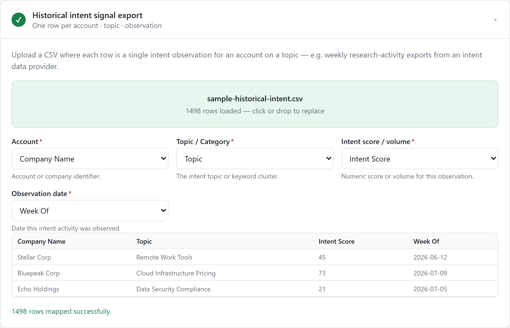
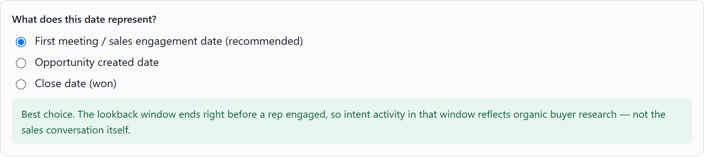

# Intent Signal Lookback Analyzer

RevOps teams buy intent data, then usually end up eyeballing it: someone scrolls through
topic surges and pipeline reports side by side, guessing which signals are worth acting on
and which are just noise the vendor is happy to sell more of. This is a single-page tool
that replaces that guesswork with an actual lookback analysis — it answers **which intent
topics genuinely preceded real pipeline, historically**, using your own historical intent
export and your own pipeline history, and then scores your current accounts against just
the topics that held up.

It's a lookback (case/control) analysis, not a machine-learning model. Everything it
computes — correlation, surge rate, collinearity, the propensity score — is shown in the
UI along with the reasoning, so you can sanity-check it against what you already know
about your accounts.

## Running it

```
npm install
npm run dev
```

Then open the printed local URL (typically `http://localhost:5173`). No backend, no
database — all parsing and analysis happens in the browser. Nothing you upload leaves
your machine.

Three sample CSVs are included so you can try the full flow immediately, and the
screenshots below are all this app running against them:

- `sample-historical-intent.csv` — 70 synthetic accounts, 7 intent topics, ~1,500
  observations. Four topics are seeded with genuine predictive signal (including one pair
  that's deliberately collinear with each other, so you can see a topic get dropped as
  redundant even though it clears the correlation threshold on its own); three are pure
  noise. This is what makes the auto-selection step in the walkthrough below produce a
  real, demonstrable result instead of an arbitrary one.
- `sample-historical-pipeline.csv` — first-meeting dates for the 22 of those 70 accounts
  that produced pipeline.
- `sample-current-accounts.csv` — 30 fresh prospect accounts with recent activity on the
  same topics, no outcome data, ready to be scored.

## The flow

1. **Upload historical intent data** — one row per account/topic/observation. Map your
   column headers to account, topic, score/volume, and date.

   

2. **Upload historical pipeline events** — one row per account, with the date real
   pipeline was created. You also tell the tool what that date *means*, with the tradeoff
   spelled out inline (see [why this choice matters](#why-lookback-to-first-meeting-not-lookback-to-close-date) below):

   

3. **Set the lookback window** and review the topic analysis — every topic's correlation
   with pipeline creation, surge rate vs. baseline, and whether it was auto-selected (and
   why, or why not). This is the sample data's Cloud Migration / Cloud Infrastructure
   Pricing pair in action: both individually clear the significance threshold, but Cloud
   Infrastructure Pricing gets dropped because it's collinear with the stronger topic.

   

4. **Upload current accounts** — same account/topic/score/date structure, no outcome
   column needed.
5. **Get ranked, scored accounts** — a 0–100 Surge Propensity Score, tier, driving
   topic(s), and a suggested next-action line, with the directional-indicator disclaimer
   shown persistently above the table. Export the ranked list as CSV.

   ![Scored results table, showing the disclaimer banner, the tier legend, and the top six ranked accounts, all Priority-tier, each with their score, tier badge, driving topics, and a "Surge on [topic] — recommend outbound..." suggested action](docs/screenshots/04-scored-results.png)

## Why lookback-to-first-meeting, not lookback-to-close-date

The whole point of this analysis is to find *buyer-initiated* research signal — activity
that happened before your team ever reached out. If the lookback window is measured back
from an event that happens **after** sales engagement started (like a close date, or a
"closed won" stage change), the window ends up including weeks or months of activity that
your own sales process generated: prospects researching your product name, comparing
proposals, checking competitor pages after a demo. That's not intent, that's homework
your buyer did *because* you were already talking to them.

Anchoring the lookback to the **first meeting date** (or whatever event marks the true
start of sales engagement) keeps the window clean: everything in it happened before a rep
was involved. That's the signal you actually want to detect and act on for *other,
not-yet-engaged* accounts. This is why the tool asks you to explicitly identify which date
concept you're using, and warns you when you pick one (like close date) that will
contaminate the window with post-engagement activity. "Opportunity created date" sits in
between — usually closer to first engagement than close date, but worth checking against
your own process.

## How surge rate and correlation work together

The tool computes two different views of the same question — "does this topic predict
pipeline?" — because each has a blind spot the other covers:

- **Surge rate** answers: *of accounts with elevated activity on this topic, what
  fraction went on to produce pipeline?* It's compared against the **baseline rate** for
  accounts without that elevation. A topic with a 75% surge rate against a 20% baseline
  is a strong, easy-to-explain signal. But surge rate on its own says nothing about how
  *often* that elevated state occurs, or how it interacts with other topics.
- **Correlation** (Pearson, computed between each account's aggregated topic
  volume/score within the lookback window and its pipeline outcome) captures the
  strength of the relationship across the full range of activity, not just an
  above/below-threshold split. It's what drives auto-selection and scoring weight,
  because it's comparable across topics on a single scale.

"Elevated" for the surge-rate calculation is defined per topic as the 75th percentile
(configurable) of aggregated activity among accounts that had *any* activity on that
topic — so it adapts to each topic's own scale rather than using one fixed number across
very different topics.

**Collinearity** is checked the same way — Pearson correlation, but between two topics'
account-level activity vectors instead of between a topic and the outcome. When two
selected-worthy topics are highly correlated with *each other* (above the collinearity
threshold, default 0.7), they're very likely capturing the same underlying buying
motion — including both would double-count that signal and inflate the scores of accounts
active in either one. The tool keeps the topic with the stronger correlation to pipeline
creation and drops the other, and says exactly which topic it was dropped in favor of.

**Auto-selection**, in order:

1. Rank topics by correlation with pipeline creation, descending.
2. Keep a topic if its correlation clears the significance threshold (default 0.3).
3. Walking down that ranked list, drop a topic if it's collinear with a
   stronger topic already kept; otherwise keep it.
4. Everything else is shown, unselected, with the specific reason (below threshold, or
   which topic it lost out to).

Every topic — selected or not — stays visible in the results table with its number and
its reason, on purpose. Nothing is hidden.

## What the Surge Propensity Score is — and isn't

Each current account's score is a weighted blend of its recent activity on the
**selected** topics only:

- Each selected topic's weight is its historical correlation with pipeline creation,
  normalized so the selected topics' weights sum to 1.
- Each account's activity on a topic is normalized against that topic's historical
  "elevated" threshold (the same 75th-percentile threshold from step 3), capped at 1x.
- The score is the weighted sum, scaled to 0–100.

**What it is:** a way to rank a list of accounts by how closely their recent research
pattern resembles the accounts that, historically, went on to produce pipeline — using
only the topics that actually showed a real relationship to that outcome, and down-
weighting or dropping ones that were noise or redundant.

**What it is not:**

- **Not a calibrated probability.** A score of 80 does not mean an 80% chance of
  producing pipeline. It's a relative ranking, not a forecast.
- **Not causal.** The analysis finds correlation, not evidence that the topic activity
  *caused* the pipeline. Confounders (company size, existing relationship, timing of an
  unrelated campaign) aren't controlled for.
- **Not a replacement for judgment.** It's meant to help prioritize who gets outbound
  attention first, not to make the call for you. A rep who knows an account is a bad fit
  should still deprioritize it regardless of score.

This disclaimer is shown persistently next to the results in the app itself, not just
here.

### Tiers

| Tier | Score | Meaning |
|---|---|---|
| Priority | ≥ 70 | Strong resemblance to historically converting accounts on selected topics — worth outbound attention soon |
| Watch | 40–69 | Partial or moderate resemblance — worth monitoring, not necessarily immediate outreach |
| Low | < 40 | Little to no elevated activity on the topics that have historically mattered |

### The "why" and the suggested action

For each scored account, the table shows the topic(s) that contributed most to its score
(its biggest normalized × weighted contributions) and a next-step line templated as:

> Surge on **[topic]** — recommend outbound referencing **[topic]** within **[X] business
> days**

`X` is configurable (default 3). If an account has no elevated activity on any selected
topic, it gets a "no significant surge detected" line instead of a fabricated one.

## CSV format reference

### Historical intent (step 1)

One row per account/topic/observation. Column names can be anything — you map them in
the UI.

| Role | Example header | Notes |
|---|---|---|
| Account | `Company Name` | Must match account naming used in the pipeline file |
| Topic / Category | `Topic` | Intent topic or keyword cluster |
| Intent score / volume | `Intent Score` | Any numeric score or volume |
| Observation date | `Week Of` | Date of that observation |

### Historical pipeline events (step 2)

One row per account that produced pipeline.

| Role | Example header | Notes |
|---|---|---|
| Account | `Company` | Must match account naming used in the intent file |
| Pipeline event date | `First Meeting Date` | Pick the date concept in the UI — first meeting is recommended |

### Current accounts (step 4)

Same shape as historical intent, minus any outcome column — just recent activity to
score.

## Known limitations

- **No significance testing.** Selection is a correlation-strength cutoff (`|r| >=
  threshold`), not a p-value or hypothesis test — the app doesn't account for sample size,
  confidence intervals, or multiple-comparison effects across however many topics you feed
  it. A correlation computed from a handful of converting accounts can look identical in
  the table to one computed from a hundred; both a topic with 3 elevated accounts and one
  with 30 pass the same `|r| >= 0.3` bar. Treat topics backed by very few
  accounts/conversions (both shown in the results table) with proportionally more
  skepticism.
- **No seasonality or time-trend modeling.** If intent activity naturally rises for
  everyone near a fiscal quarter end, a product launch, or a market event — independent of
  actual buying intent — the analysis has no way to distinguish that from a genuine signal.
- **Account names must match exactly (case-sensitive) across files.** "Acme Corp" and
  "acme corp" are treated as two different accounts. There's no fuzzy matching, so if your
  intent, pipeline, and current-accounts exports don't share a consistent account naming
  convention, accounts will silently fail to link up rather than erroring loudly — spot-
  check the account counts shown after each upload if the numbers look off.
- **Control accounts share one anchor date, not individual ones.** Accounts with no
  matching pipeline row are treated as controls and anchored to the most recent date found
  in the historical intent file (they have no event of their own to look back from), not a
  per-account "as of" date. This assumes non-converting accounts were meaningfully
  comparable as of that one shared point in time — reasonable if your intent export covers
  a consistent recent window, noisier if it spans a long or uneven period.
- **Aggregation is a simple sum**, not a rate or an average. An account with many small
  observations in the lookback window can out-aggregate one with fewer but larger
  observations. If your intent provider already emits normalized/rolled-up scores, this
  is usually fine; if it emits raw event-level rows, accounts with just noisier or more
  frequent tracking can look more "elevated" than they really are.
- **Correlation isn't causation.** Confounders outside the uploaded columns — company
  size, an existing relationship, a marketing campaign that happened to run at the same
  time — aren't controlled for. See "What the Surge Propensity Score is — and isn't"
  above.
- Rows with a missing account/topic or an unparseable score/date are silently dropped from
  that file's analysis, and the count of skipped rows is shown next to the mapping so you
  can catch a bad column mapping early.
